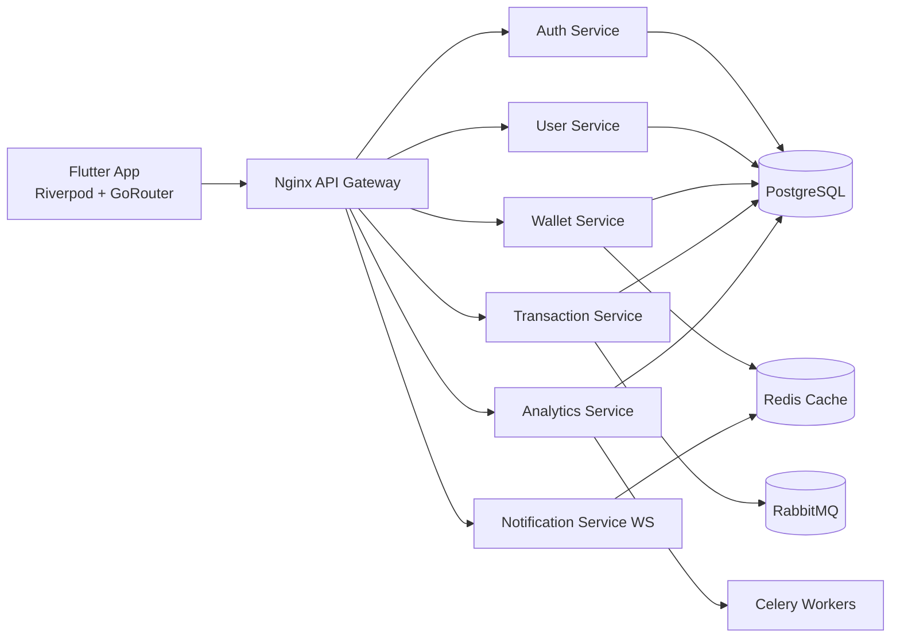

# Finexia – SaaS Fintech Scalable Platform (Flutter + Python Microservices)

Finexia is a production-oriented starter kit for a fintech SaaS product that centralizes bank accounts, crypto wallets, and manual assets into one intelligent dashboard.

## Product goals
- Connect bank providers (Plaid-style simulation).
- Connect crypto providers (Binance / Coinbase / CoinGecko adapters).
- Track manual accounts (cash/savings/business).
- Aggregate net worth in real-time.
- Deliver anomaly detection, recommendations, and a financial score.

## Monorepo structure
```text
backend/
  services/
    auth_service/
    user_service/
    wallet_service/
    transaction_service/
    analytics_service/
    notification_service/
  shared/
  schema.sql
infra/
  nginx.conf
  k8s/
lib/
  src/
    app/
    core/
    features/
.github/workflows/
```

## Architecture diagram


## Microservices
- **Auth Service**: JWT + refresh token, bcrypt password hashing, RBAC-ready.
- **User Service**: profile + preferences.
- **Wallet Service**: multi-wallet management with sync-friendly model.
- **Transaction Service**: CRUD with simple anomaly detection.
- **Analytics Service**: financial score, recommendation, projection.
- **Notification Service**: real-time WebSocket alert stream.

## Security baseline
- JWT + refresh token separation.
- Password hashing with bcrypt.
- Reverse proxy boundary with Nginx.
- Ready for HTTPS termination and WAF on cloud ingress.
- Database UUID-first model and indexed critical queries.

## Run locally (dev)
```bash
docker compose up --build
```

## CI/CD
GitHub Actions workflow at `.github/workflows/ci.yml` runs backend dependency install and smoke import.

## Cloud deployment
See `docs/aws-deployment-guide.md` for ECS/EKS production deployment strategy.

## Frontend highlights
- Clean Architecture style module split by feature.
- Riverpod for state management.
- GoRouter for route orchestration.
- fl_chart dashboard graph baseline.
- Dark mode via app themes.

## Investor-ready checklist
- [x] Multi-service domain separation
- [x] Real-time channel (WebSocket)
- [x] Async-ready stack (Celery + RabbitMQ + Redis)
- [x] Containerized runtime (Docker + Compose)
- [x] Kubernetes manifests starter
- [x] Cloud deployment playbook
